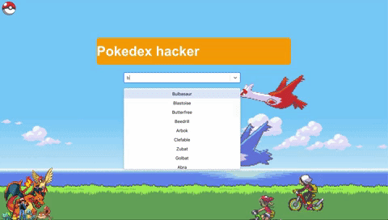

# Pokedex Hacker
The Pokedex Hacker helps identify counter types to an opponent's Pokemon. Users can enter in dual types or the opposing Pokemon's name and receive the most effective types to overthrow their opponent. Super-effective moves can cause 2x damage. Made with Python.

## Inspiration
The idea came from playing competitively with a friend on [Pokemon Showdown Beta](https://play.pokemonshowdown.com/), a Pokemon battle simulator where you can have online Pokemon matches. With real-time play, it was frustrating having to manually look up weaknesses for each dual type pokemon, so therefore I came up with the idea of an automated counter-type generator.
